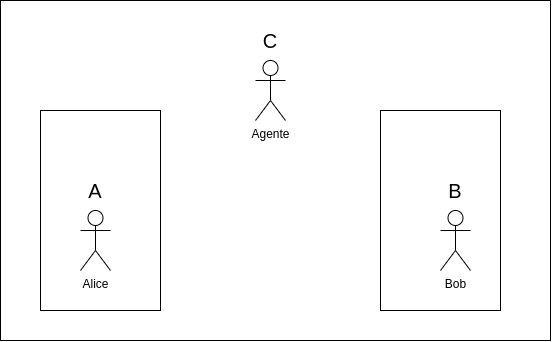
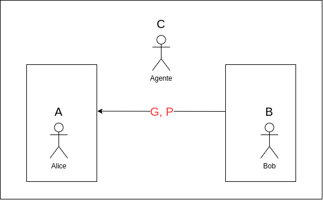
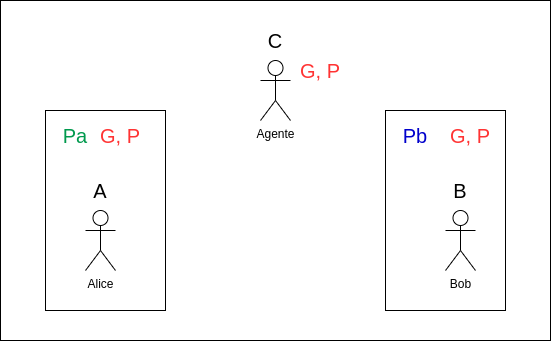
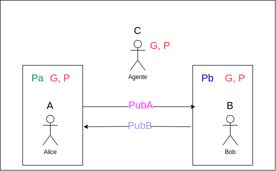

# Criptografia e Diffie-Hellman

A segurança em uma comunicação é uma parte bastante importante das redes de computadores. Atualmente, muita informação importante e sigilosa é enviada e recebida a todo momento, e para que isso seja feito de maneira segura, é necessário criptografar tais informações.

_Criptografia_ refere-se ao ato de codificar informações, transformando-as para que somente aqueles que possuem o código possam entendê-la. Existem diversas técnicas de criptografia, no entanto, o escopo deste trabalho resume-se apenas a criptografia simétrica. Nela, uma chave secreta é estabelecida entre dois ou mais processos, e serve para codificar e decodificar mensagens enviadas por um meio não seguro. Isto é, a partir de um código que somente duas ou mais partes sabem, é possível comunicar-se de forma completamente sigilosa.

No contexto de redes isso é um pouco mais complicado, pois envolve um problema óbvio: Como duas partes que precisam necessariamente estabelecer comunicação podem estabelecer uma chave secreta sem enviá-la pelo meio?

É neste contexto que o Algoritmo de Diffie-Hellman permite estabelecer tal chave, sem que nenhum agente no meio inseguro a conheça.

## Algoritmo de Diffie-Hellman

Para compreender melhor o algoritmo, exemplificaremos o seu funcionamento a partir do caso de Alice (A) e Bob (B) que desejam comunicar em segredo, no entanto, há um agente malicioso que está escutando o meio (C), e ele pretende descobrir o que está sendo transmitido. Isso é ilustrado na figura a seguir.
<center>

</center>

Inicialmente, é necessário que Alice e Bob conheçam dois números interios aleatórios _g_ e _p_. Supondo que Bob gere ambos, eles são transmitidos para Alice através do meio, de forma completamente pública. O agente tem acesso a estes números, e ele os guarda imediatamente.
<center>

</center>

Em seguida, Alice e Bob escolhem uma chave particular, que somente cada um deles sabe. Ela pode ser escolhida aleatoriamente, e é representada por _Pa_ para Alice e _Pb_ para Bob.

<center>

</center>

A partir disso, ambos calculam uma chave pública :

- _pubA_ = _g ^ Pa_ mod n

- _pubB_ = _g ^ Pb_ mod n

E cada um a envia pelo meio. Também interceptada pelo agente.
<center>

</center>

Nesse momento, Alice e Bob podem estabelecer a chave secreta fazendo uma conta simples:

<center>
<b>Bob</b>   :       _chave_ = _pubA_ ^ _Pb_ mod n = (_g ^ Pa_) ^ _Pb_ mod n

<b>Alice</b> :       _chave_ = _pubB_ ^ _Pa_ mod n = (_g ^ Pb_) ^ _Pa_ mod n
</center>
Isso é evidenciado pela propriedade da exponenciação de mesma base, pois:
<center>
 (_g ^ Pb_) ^ _Pa_ mod n = _g ^ (Pa * Pb)_ mod n

 (_g ^ Pa_) ^ _Pb_ mod n = _g ^ (Pa * Pb)_ mod n
</center>

A partir disso esta chave pode ser usada para codificar e decodificar mensangens pelo meio.

Mas e o agente que estava escutando no meio não seguro? Bom, ele não sabe como cálculá-la, pois a informação que passou por ele foi:


- _g_ e _p_

- _pubA_ = _g ^ Pa_ mod n

- _pubB_ = _g ^ Pb_ mod n

Somente com estes 4 valores é impossível calcular o valor da chave, pois não se sabe nem o valor de _Pa_ nem de _Pb_. Isso é possível através da operação de resto _mod_, que mapeia um grande número de entradas para um único número. Desta forma, só seria possível encontrar a chave "chutando" valores de _Pa_ e _Pb_.


## Implementação da Criptografia

O algoritmo de Diffie-Hellman foi implementado no sistema cliente-servidor, que é criptografado através do algortimo simétrico AES da biblioteca [Crypto](https://pypi.org/project/cryptography/). Inicialmente, o cliente após conectar-se com sucesso ao servidor, gera os números aleatórios e os envia, aguardando a chave pública do servidor. O servidor envia sua chave pública e recebe a chave do cliente, em seguida, ambas as partes calculam a chave secreta e a comunicação pode iniciar.

Todas as funções de codificação podem ser encontradas no arquivo _encryption.py_ que pode ser acessado [aqui](encryption.py.txt). Nele três funções são descritas:

- ```encode_key(key)```

converte uma chave (inteiro) em bytes, e ajusta o seu tamanho para 16 bytes.

- ```encrypt(msg, key)```

codifica uma mensagem a partir da chave, também faz um _padding_ para que ela possua um tamanho divisível por 16, neste caso, o caractere escolhido foi '#' para o preenchimento.

- ```decrypted(msg, key)```

decodifica uma mensagem a partir da chave, retirando o _padding_ feito pela codificação e retornando a mensagem original.
